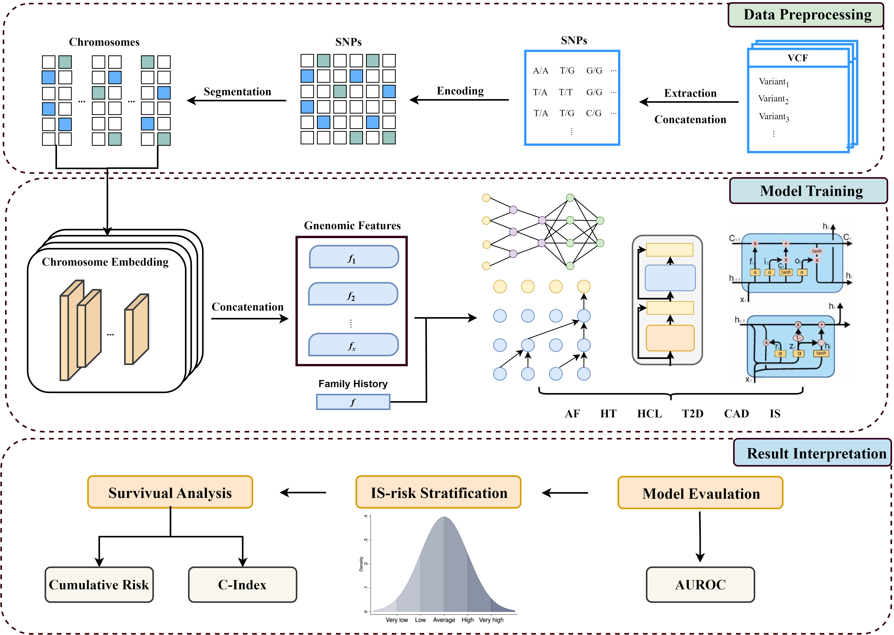

# Genomic Transformer for Disease Prediction

This project implements a Transformer-based multi-task learning model for predicting diseases based on SNP genomic data and family history features. **The provided data is dummy data and should not be used for actual genomic analysis.**

## Abstract

Current genome-wide association studies provide valuable insights into the genetic basis of ischaemic stroke (IS) risk. However, polygenic risk scores, the most widely used method for genetic risk prediction, have notable limitations due to their linear nature and inability to capture complex, non-linear interactions among genetic variants. While deep neural networks offer advantages in modelling these complex relationships, the multifactorial nature of IS and the influence of modifiable risk factors present additional challenges for genetic risk prediction.

To address these challenges, we propose a Chromosome-wise Multi-task Genomic (MetaGeno) framework that utilizes genetic data from IS and five related diseases. The framework includes a chromosome-based embedding layer to model local and global interactions among adjacent variants, enabling a biologically informed approach. Incorporating multi-disease learning further enhances predictive accuracy by leveraging shared genetic information.

Among various sequential models tested, the Transformer demonstrated superior performance and outperformed other machine learning models and PRS baselines, achieving an AUROC of 0.809 on the UK Biobank dataset. Risk stratification identified a 2-fold increased stroke risk (HR = 2.14; 95% CI: 1.81–2.46) in the top 1% risk group, with a nearly 5-fold increase in those with modifiable risk factors such as atrial fibrillation and hypertension. Finally, the model was validated on the diverse All of Us dataset (AUROC = 0.764), highlighting ancestry and population differences while demonstrating effective generalization.



## Data Source

This study is based on genomic data from the **UK Biobank (UKBB)**, a large-scale biomedical database containing genetic and health information from over 500,000 participants. To access the original UKBB dataset, researchers must submit an application through the UK Biobank portal: [🔗 UK Biobank Access Application](https://www.ukbiobank.ac.uk/enable-your-research/apply-for-access)

## Data Format

The repository includes simulated (dummy) example data to demonstrate the input structure required by the MetaGeno framework. These files mimic genomic data but do not contain identifiable information. Below is a description of the expected format for each input:

- `data/processed/labels.npy`  
  A NumPy array of shape `(N,)`, where `N` is the number of samples. Each value is a binary label indicating whether the individual had ischemic stroke (0 = control, 1 = case).

- `data/processed/family_history.npy`  
  A NumPy array of shape `(N, 6)`, where each column represents a binary indicator (0 or 1) for family history of six common diseases, corresponding to:
  1. Atrial Fibrillation (AF)
  2. Hypertension (HT)
  3. Hypercholesterolemia (HCL)
  4. Type 2 Diabetes (T2D)
  5. Coronary Artery Disease (CAD)
  6. Ischemic Stroke (IS)

- `data/processed/chr{i}.npy` (e.g., `chr1.npy`, `chr2.npy`, ..., `chr22.npy`)  
  For each chromosome `i`, a NumPy array of shape `(N, S_i)`, where `S_i` is the number of selected SNPs on chromosome `i`. Each row represents the genotype of one individual, encoded as 0, 1, or 2 (zygosity).

> All files should be placed in `data/processed/`, and paths should be configured in `config.yaml`.

## Data Preprocessing

The SNP features used in MetaGeno are selected based on known risk loci identified by genome-wide association studies (GWAS). To construct the input feature space:

1. We first obtained summary statistics from high-quality GWAS for IS and five related metabolic risk factors.
2. Significant SNPs were extracted from each GWAS result, and overlapping SNPs across traits were retained.
3. For each selected SNP, genotype dosages were extracted from VCF-like matrices and encoded as integer values (0, 1, 2).

The following GWAS datasets from the PGS Catalog (https://www.pgscatalog.org/) were used to select SNPs:

- **Ischemic Stroke (IS):** PGS000665  
- **Atrial Fibrillation (AF):** PGS000035  
- **Coronary Artery Disease (CAD):** PGS002262  
- **Hypertension (HT):** PGS003012  
- **Hypercholesterolemia (HCL):** PGS002274  
- **Type 2 Diabetes (T2D):** PGS003107

> The current repository includes only simulated data with the same structure as described above. Users may replace these with real genotype matrices and summary statistics according to their own data access.

## Dependencies

To run the MetaGeno framework, the following dependencies are required:

- **Python 3.8+**  
  We recommend using a virtual environment (e.g., `venv` or `conda`).

- **PyTorch >= 1.10**  
  [https://pytorch.org/get-started/locally/](https://pytorch.org/get-started/locally/)  
  Please install the CUDA-compatible version if using GPU.

- **NumPy** (>=1.21)

- **Pandas**

- **scikit-learn** (>=0.24)

- **PyYAML**  
  Used for reading configuration files.

Optional:

- **matplotlib / seaborn**  
  For generating plots during evaluation and risk stratification.

---

You can install all required packages using:

```bash
pip install -r requirements.txt


### Train the Model

```bash
python main.py --config config.yaml
```


